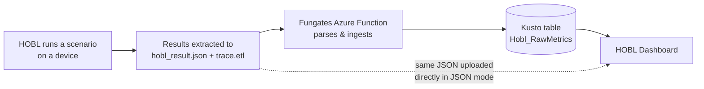
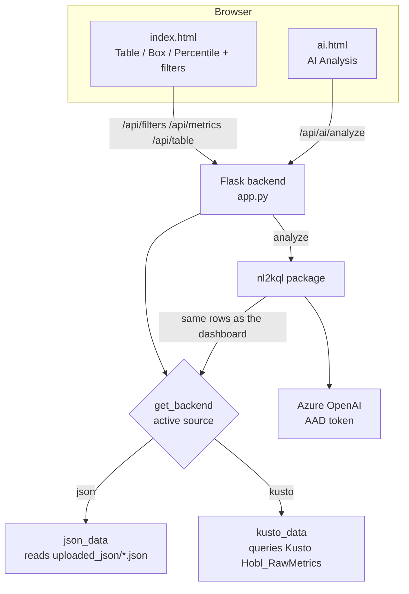
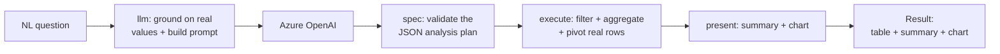

# HOBL Dashboard

A local web dashboard for exploring **HOBL** (Hardware-Optimized Benchmark Lab) power &
performance metrics from Windows device test runs. It has two halves:

- **Interactive viewers** — filter runs and inspect metrics as a **Table**, **Box & Whisker**
  plot, or **Percentile** view.
- **AI Analysis** — ask a question in plain English (e.g. *"compare system power between the
  two devices"*) and get a computed table, a written summary, and a chart.

Everything runs on `localhost`; no data is exposed externally.

---

## Who built what (handover)

| Area | Author |
|---|---|
| Core dashboard, **Kusto** + **JSON** data sources, runtime source switching, **Table / Box & Whisker / Percentile** viewers, filters (device, RAM, scenario, host, date, iteration) | **Ananya Agarwal** |
| **AI Analysis** feature (natural-language → analysis) and the `nl2kql/` package | **Aditya Raj Sharma** |

Every commit keeps its original author — run `git log` or use GitHub **Blame** to see line-level attribution.

---

## Table of contents

1. [End-to-end data flow](#end-to-end-data-flow)
2. [Application architecture](#application-architecture)
3. [Data sources (JSON vs Kusto)](#data-sources-json-vs-kusto)
4. [Feature 1 — Dashboard viewers](#feature-1--dashboard-viewers)
5. [Feature 2 — AI Analysis (`nl2kql`)](#feature-2--ai-analysis-nl2kql)
6. [Project structure](#project-structure)
7. [API endpoints](#api-endpoints)
8. [Configuration](#configuration)
9. [Setup & run](#setup--run)
10. [Authentication](#authentication)
11. [Handover notes](#handover-notes)

---

## End-to-end data flow

The dashboard is the final consumer of a pipeline that starts with HOBL running a scenario:



The dashboard can read the metrics from **two** places (see [Data sources](#data-sources-json-vs-kusto)):
the **Kusto** table (final source) or **uploaded JSON** result files (a stand-in used until the
new Kusto columns are deployed).

---

## Application architecture



**Key idea — one pluggable data surface.** Both backends (`json_data`, `kusto_data`) expose the
**same** functions and record shape:

- `get_filter_options()` — distinct values for every filter
- `get_metrics(...)` — one row per metric, matching the filters
- `get_table_data(...)` — per-iteration transposed columns for the Table view

Because the surface is identical, the routes, the frontend, **and** the AI feature work the same
regardless of the active source.

---

## Data sources (JSON vs Kusto)

Switch the active source at runtime from the **top-right control** in the UI. The choice is
persisted to `runtime_state.json` and survives restarts.

| | **JSON mode** (default) | **Kusto mode** (final) |
|---|---|---|
| Backend | `json_data.py` | `kusto_data.py` |
| Reads from | JSON files you **upload** through the UI (stored in `uploaded_json/`) | The `Hobl_RawMetrics` Kusto table |
| Requires | Nothing — just upload `hobl_result*.json` | VPN + Azure AD RBAC on the cluster |
| Purpose | Stand-in until the new Kusto columns are deployed | Permanent production source |

In JSON mode the dashboard shows **no data until you upload** result files. Uploads can be cleared
from the same control.

---

## Feature 1 — Dashboard viewers

The main page (`/`, [templates/index.html](templates/index.html)) offers three ways to look at the
selected runs, backed by shared filter logic in [static/js/common.js](static/js/common.js):

| Viewer | File | Shows |
|---|---|---|
| **Table** | [static/js/table.js](static/js/table.js) | Per-iteration, Excel-style transposed metrics table |
| **Box & Whisker** | [static/js/box.js](static/js/box.js) | Distribution of a metric across iterations |
| **Percentile** | [static/js/percentile.js](static/js/percentile.js) | Percentile breakdown (P50/P70/P90, …) |

**Filters** (all optional; an omitted filter means "all"): `device`, `ram`, `scenario`, `host`,
`start_date`, `end_date`, `last_n` (most recent N runs by run date), `start_iter`, `end_iter`.

---

## Feature 2 — AI Analysis (`nl2kql`)

The AI page (`/ai`, [templates/ai.html](templates/ai.html)) turns a natural-language question into
a concrete, **read-only** analysis over whatever data source is currently active.



**How it stays accurate and safe:**

- The LLM only emits a small, **validated JSON spec** (filters / grouping / aggregation). It never
  runs code and never sees credentials.
- All numbers are computed **deterministically in Python** from real rows, so figures are never
  hallucinated.
- It reads rows through the **same** `backend.get_metrics(...)` the dashboard uses, so the AI always
  sees exactly what the dashboard shows.
- The operation is strictly read-only.

**Package layout** — public API is the single function `nl2kql.analyze(question, context, clarification, backend)`:

| Module | Responsibility |
|---|---|
| [nl2kql/__init__.py](nl2kql/__init__.py) | `analyze()` orchestrator — wires the pipeline together |
| [nl2kql/llm.py](nl2kql/llm.py) | Azure OpenAI access (AAD), data-grounding, prompt building |
| [nl2kql/spec.py](nl2kql/spec.py) | Validate the model's JSON plan; render the displayed KQL |
| [nl2kql/execute.py](nl2kql/execute.py) | Deterministic filter / aggregate / pivot / sort |
| [nl2kql/present.py](nl2kql/present.py) | Human-readable summary + chart selection |

An optional second LLM pass only **rewords** the already-computed summary (controlled by
`AI_SUMMARY_POLISH`); it can never change a number.

---

## Project structure

```
HOBL-Custom-Dashboard/
├── app.py                  # Flask app: routes + runtime data-source switching
├── config.py               # Configuration (see "Configuration" — ships with placeholders)
├── json_data.py            # JSON-file backend (upload-based stand-in)
├── kusto_data.py           # Kusto backend (final source)
├── generate_doc.py         # Generates DESIGN_DOCUMENT.md
├── requirements.txt        # Python dependencies
├── runtime_state.json      # Persisted active data source (git-ignored)
│
├── nl2kql/                 # AI Analysis backend (natural-language → analysis)
│   ├── __init__.py         #   analyze() orchestrator — the only public API
│   ├── llm.py              #   Azure OpenAI (AAD), grounding, prompts
│   ├── spec.py             #   validate spec + render displayed KQL
│   ├── execute.py          #   deterministic filter / aggregate / pivot
│   └── present.py          #   summary + chart selection
│
├── templates/
│   ├── base.html           # Shared header / layout
│   ├── index.html          # Dashboard (viewers + filters)
│   └── ai.html             # AI Analysis page
│
├── static/
│   ├── css/styles.css
│   └── js/
│       ├── common.js       # Shared filter + data-source logic
│       ├── table.js        # Table viewer
│       ├── box.js          # Box & Whisker viewer
│       └── percentile.js   # Percentile viewer
│
├── logos/ , static/img/    # Branding
└── uploaded_json/          # Uploaded JSON files in JSON mode (git-ignored)
```

---

## API endpoints

| Endpoint | Method | Purpose |
|---|---|---|
| `/` | GET | Dashboard page (viewers) |
| `/ai` | GET | AI Analysis page |
| `/api/datasource` | GET / POST | Get or set the active source (`json` \| `kusto`) |
| `/api/datasource/upload` | POST | Upload one or more JSON result files (JSON mode) |
| `/api/datasource/clear` | POST | Remove all uploaded JSON files |
| `/api/filters` | GET | Distinct values for every filter |
| `/api/metrics` | GET | Metrics matching the selected filters |
| `/api/table` | GET | Per-iteration transposed table data |
| `/api/ai/analyze` | POST | Run a natural-language analysis (`nl2kql`) |

All responses are JSON. Filter inputs are parsed/sanitized server-side.

---

## Configuration

All settings live in [config.py](config.py) and read from **environment variables** with safe
placeholder defaults, so the committed file never contains real infrastructure values:

| Setting | Purpose |
|---|---|
| `DATA_SOURCE` | Default source on first run (`json` or `kusto`) |
| `UPLOAD_DIR` | Where uploaded JSON files are stored (JSON mode) |
| `RUNTIME_STATE_FILE` | Where the runtime-selected source is persisted |
| `KUSTO_CLUSTER` / `KUSTO_DATABASE` / `KUSTO_TABLE` | Kusto connection (fill your own) |
| `HOST` / `PORT` / `DEBUG` | Flask server settings |
| `AZURE_OPENAI_ENDPOINT` / `_DEPLOYMENT` / `_API_VERSION` | Azure OpenAI resource for AI Analysis |
| `AI_SUMMARY_POLISH` | `1` = let the model reword the summary; `0` = fast offline template only |

> **Fill in your own values.** On a fresh clone, set the Kusto and Azure OpenAI values (via
> environment variables or by editing your local copy) — the repo ships **placeholders** like
> `<your-cluster>.kusto.windows.net`. Do **not** commit real internal endpoints to a public repo.

---

## Setup & run

**Prerequisites**
- Python 3.10+ (developed on 3.14)
- For **Kusto mode**: VPN + an Azure AD account with RBAC on the Kusto cluster
- For **AI Analysis**: an Azure AD account with access to an Azure OpenAI resource

```powershell
# from the repo root
python -m venv venv
.\venv\Scripts\Activate.ps1
pip install -r requirements.txt

# set your config values (see Configuration), then:
python app.py
```

Then open **http://127.0.0.1:5000**.

> `requirements.txt` lists `flask`, `azure-kusto-data`, and `azure-identity`. The AI feature also
> uses `requests`, which installs transitively with the Azure SDKs; if it's ever missing, run
> `pip install requests`.

---

## Authentication

- **Kusto mode** — Azure AD interactive browser sign-in (via `azure-identity`). A browser tab opens
  on the first query; the token is cached for the session. Only accounts with RBAC on the cluster
  can read data.
- **AI Analysis** — Azure AD token for Azure OpenAI (`DefaultAzureCredential`, falling back to an
  interactive browser sign-in). **No API key is stored.**

---

## Handover notes

- **`config.py` secrets.** In the original working copy, `config.py` was marked
  `git update-index --skip-worktree` so local real endpoints stayed **out of git** while the repo
  kept placeholders. On a fresh clone you supply your own values. Keep real internal endpoints out
  of any public repo.
- **Local/ignored files.** `runtime_state.json` and `uploaded_json/` are local and git-ignored.
- **Two backends, one surface.** `json_data` and `kusto_data` implement the same
  `get_filter_options` / `get_metrics` / `get_table_data`; switching sources needs **no** route or
  frontend changes.
- **`DESIGN_DOCUMENT.md`** is auto-generated by [generate_doc.py](generate_doc.py) and describes the
  original Kusto pipeline; this README supersedes it for the current app (JSON source, runtime
  switching, and AI Analysis).
